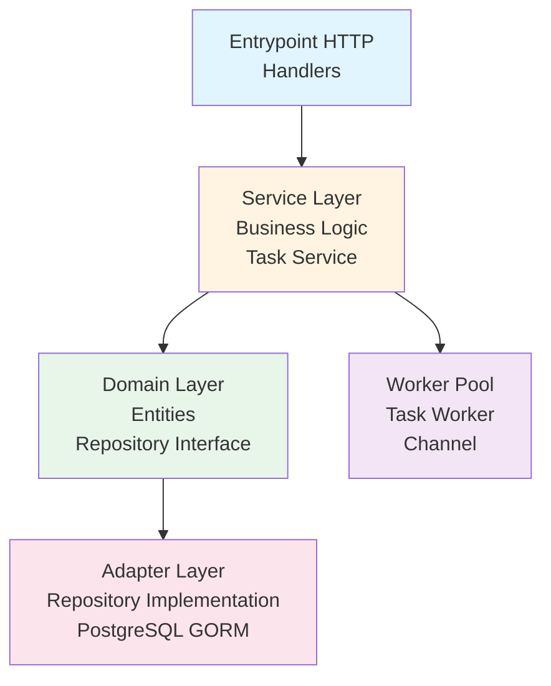
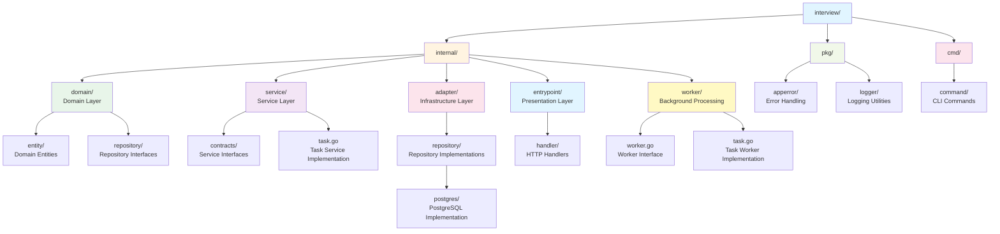
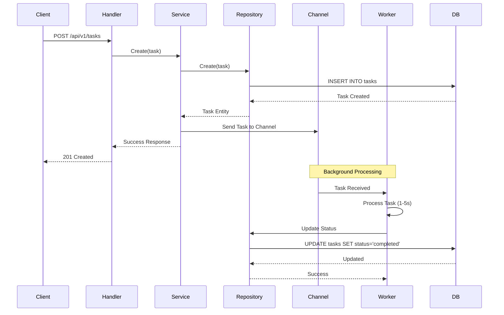
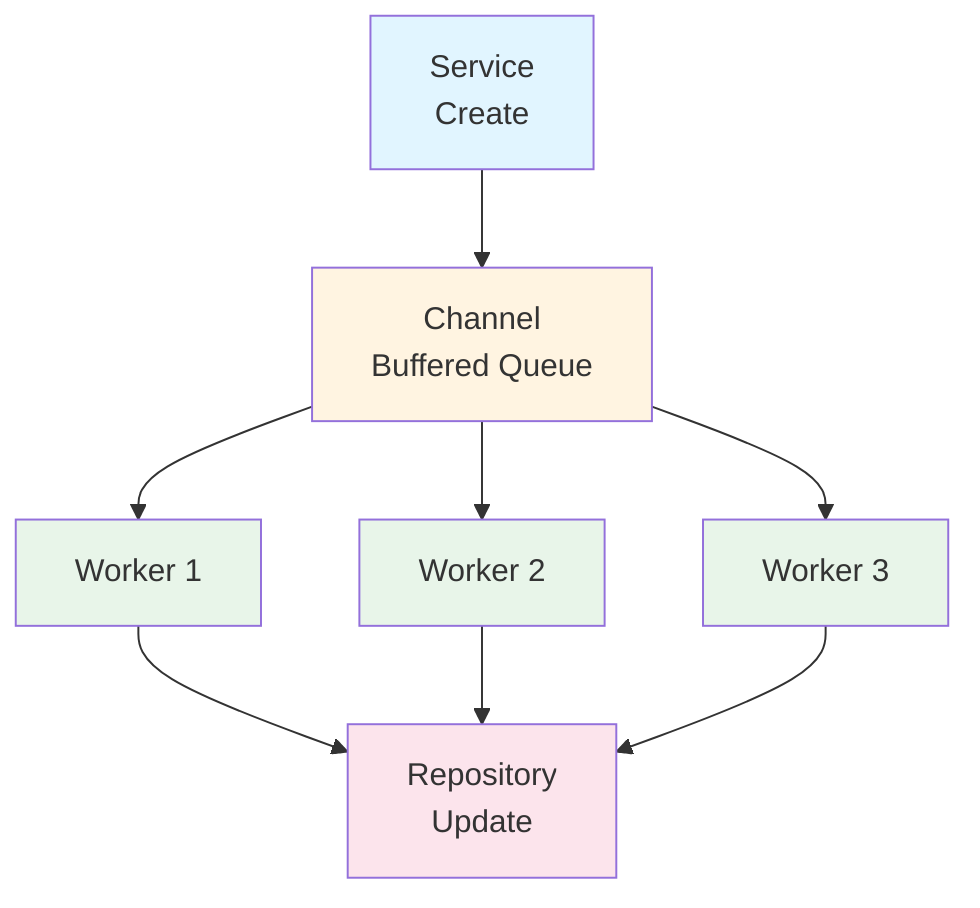

# Task Pool API - پروژه مصاحبه

یک سرویس REST API برای مدیریت و پردازش غیرهمزمان تسک‌ها با استفاده از Go و معماری Clean Architecture.

## 📋 فهرست مطالب

- [معرفی پروژه](#معرفی-پروژه)
- [ویژگی‌های کلیدی](#ویژگیهای-کلیدی)
- [معماری و طراحی](#معماری-و-طراحی)
- [تکنولوژی‌های استفاده شده](#تکنولوژیهای-استفاده-شده)
- [پیش‌نیازها](#پیشنیازها)
- [نصب و راه‌اندازی](#نصب-و-راهاندازی)
- [API Documentation](#api-documentation)
- [تست‌ها](#تستها)
- [Worker Pool](#worker-pool)
- [متغیرهای محیطی](#متغیرهای-محیطی)

## معرفی پروژه

این پروژه یک سرویس مدیریت تسک است که امکان ایجاد، مشاهده و پردازش غیرهمزمان تسک‌ها را فراهم می‌کند. تسک‌ها پس از ایجاد، به صورت خودکار توسط یک Worker Pool پردازش می‌شوند و وضعیت آن‌ها به‌روزرسانی می‌گردد.

### هدف پروژه

نمایش مهارت‌های زیر در مصاحبه:

- پیاده‌سازی Clean Architecture
- استفاده از Design Patterns (Repository, Service Layer)
- پیاده‌سازی Worker Pool برای پردازش غیرهمزمان
- نوشتن تست‌های واحد و همزمانی
- مدیریت خطا و Logging
- استفاده از Docker و Docker Compose

## ویژگی‌های کلیدی

✅ **Clean Architecture**: جداسازی لایه‌ها و وابستگی‌های معکوس  
✅ **Worker Pool Pattern**: پردازش غیرهمزمان تسک‌ها با چند Worker  
✅ **Repository Pattern**: جداسازی منطق دسترسی به داده  
✅ **Error Handling**: مدیریت خطا با ساختار مشخص  
✅ **Structured Logging**: استفاده از Zerolog برای لاگ‌های ساختاریافته  
✅ **Unit Tests**: تست‌های واحد با پوشش مناسب  
✅ **Concurrent Tests**: تست‌های همزمانی برای Worker Pool  
✅ **Docker Support**: پشتیبانی کامل از Docker و Docker Compose  
✅ **Configuration Management**: مدیریت تنظیمات با envconfig

## معماری و طراحی

پروژه از **Clean Architecture** استفاده می‌کند که شامل لایه‌های زیر است:



### ساختار پوشه‌ها



### Design Patterns استفاده شده

1. **Repository Pattern**: جداسازی منطق دسترسی به داده
2. **Service Layer Pattern**: جداسازی منطق کسب‌وکار
3. **Worker Pool Pattern**: پردازش غیرهمزمان با چند Worker
4. **Dependency Injection**: تزریق وابستگی‌ها از طریق Constructor
5. **Interface Segregation**: استفاده از Interface برای جداسازی Concerns

## تکنولوژی‌های استفاده شده

- **Language**: Go 1.25.1
- **Web Framework**: Fiber v2.52.10
- **ORM**: GORM v1.25.12
- **Database**: PostgreSQL
- **Logging**: Zerolog v1.34.0
- **Testing**: Testify v1.9.0
- **Configuration**: envconfig v1.4.0
- **CLI**: Cobra v1.10.2
- **Containerization**: Docker & Docker Compose

## پیش‌نیازها

- Go 1.21 یا بالاتر
- PostgreSQL 12 یا بالاتر
- Docker و Docker Compose (برای اجرای با Docker)
- Make (اختیاری، برای دستورات ساده‌تر)

## نصب و راه‌اندازی

### روش ۱: اجرا با Docker Compose (پیشنهادی)

ساده‌ترین روش برای اجرای پروژه:

```bash
# کلون کردن پروژه
git clone <repository-url>
cd interview

# اجرای با Docker Compose
docker-compose up --build
```

این دستور به صورت خودکار:

- دیتابیس PostgreSQL را راه‌اندازی می‌کند
- جدول‌های لازم را ایجاد می‌کند
- اپلیکیشن را اجرا می‌کند

API در آدرس `http://localhost:8080` در دسترس خواهد بود.

### روش ۲: راه‌اندازی دستی

#### ۱. نصب وابستگی‌ها

```bash
go mod download
```

#### ۲. تنظیم دیتابیس

یک دیتابیس PostgreSQL ایجاد کنید:

```sql
CREATE DATABASE task_pool;
```

#### ۳. تنظیم متغیرهای محیطی

یک فایل `.env` در ریشه پروژه ایجاد کنید:

```env
DATABASE_HOST=localhost
DATABASE_PORT=5432
DATABASE_USERNAME=postgres
DATABASE_PASSWORD=postgres
DATABASE_NAME=task_pool
DATABASE_SSLMODE=disable
SERVER_PORT=8080
TASK_WORKER_WORKERS=3
TASK_WORKER_QUEUE_SIZE=100
```

#### ۴. اجرای اپلیکیشن

```bash
go run cmd/main.go http
```

### ساخت Docker Image

برای ساخت Docker image:

```bash
docker build -t task-pool:latest .
```

برای اجرای container:

```bash
docker run -p 8080:8080 \
  -e DATABASE_HOST=host.docker.internal \
  -e DATABASE_PORT=5432 \
  -e DATABASE_USERNAME=postgres \
  -e DATABASE_PASSWORD=postgres \
  -e DATABASE_NAME=task_pool \
  task-pool:latest
```

## API Documentation

### Base URL

```
http://localhost:8080/api/v1
```

### ۱. ایجاد تسک جدید

**Endpoint:** `POST /api/v1/tasks`

**Request Body:**

```json
{
  "title": "Task Title",
  "description": "Task Description"
}
```

**Response (201 Created):**

```json
{
  "message": "Task created successfully"
}
```

**Example:**

```bash
curl -X POST http://localhost:8080/api/v1/tasks \
  -H "Content-Type: application/json" \
  -d '{
    "title": "Process Payment",
    "description": "Process customer payment for order #123"
  }'
```

### ۲. دریافت تمام تسک‌ها

**Endpoint:** `GET /api/v1/tasks`

**Response (200 OK):**

```json
[
  {
    "ID": 1,
    "Title": "Task Title",
    "Description": "Task Description",
    "Status": "completed",
    "CreatedAt": "2024-01-01T00:00:00Z",
    "UpdatedAt": "2024-01-01T00:05:00Z"
  }
]
```

**Example:**

```bash
curl http://localhost:8080/api/v1/tasks
```

### ۳. دریافت تسک با ID

**Endpoint:** `GET /api/v1/tasks/:id`

**Response (200 OK):**

```json
{
  "ID": 1,
  "Title": "Task Title",
  "Description": "Task Description",
  "Status": "completed",
  "CreatedAt": "2024-01-01T00:00:00Z",
  "UpdatedAt": "2024-01-01T00:05:00Z"
}
```

**Response (404 Not Found):**

```json
{
  "error": "task not found"
}
```

**Example:**

```bash
curl http://localhost:8080/api/v1/tasks/1
```

### ۴. Health Check

**Endpoint:** `GET /health`

**Response (200 OK):**

```
OK
```

**Example:**

```bash
curl http://localhost:8080/health
```

### مثال کامل استفاده

```bash
# 1. ایجاد یک تسک جدید
curl -X POST http://localhost:8080/api/v1/tasks \
  -H "Content-Type: application/json" \
  -d '{
    "title": "Process Payment",
    "description": "Process customer payment for order #123"
  }'

# خروجی: {"message":"Task created successfully"}

# 2. منتظر می‌مانیم تا Worker تسک را پردازش کند (1-5 ثانیه)

# 3. بررسی وضعیت تسک
curl http://localhost:8080/api/v1/tasks/1

# خروجی (پس از پردازش):
# {
#   "ID": 1,
#   "Title": "Process Payment",
#   "Description": "Process customer payment for order #123",
#   "Status": "completed",
#   "CreatedAt": "2024-01-01T00:00:00Z",
#   "UpdatedAt": "2024-01-01T00:05:00Z"
# }

# 4. دریافت تمام تسک‌ها
curl http://localhost:8080/api/v1/tasks
```

## تست‌ها

پروژه شامل تست‌های واحد و همزمانی است که پوشش مناسبی از کد را فراهم می‌کند.

### اجرای تست‌ها

```bash
# اجرای تمام تست‌ها
go test ./...

# اجرای تست‌های یک پکیج خاص
go test ./internal/service/...
go test ./internal/worker/...

# اجرای تست با نمایش جزئیات
go test -v ./...

# اجرای تست با نمایش coverage
go test -cover ./...

# اجرای تست با گزارش coverage کامل
go test -coverprofile=coverage.out ./...
go tool cover -html=coverage.out
```

### تست‌های موجود

#### Service Tests (`internal/service/task_test.go`)

- ✅ تست ایجاد تسک
- ✅ تست دریافت تسک با ID
- ✅ تست دریافت تمام تسک‌ها
- ✅ تست خطاهای NotFound
- ✅ تست ارسال همزمان چندین تسک (Concurrent Tests)

#### Worker Tests (`internal/worker/task_test.go`)

- ✅ تست پردازش تسک توسط Worker
- ✅ تست تغییر وضعیت تسک به completed
- ✅ تست پردازش همزمان چندین تسک
- ✅ تست Worker Pool با چند Worker

### Coverage

برای مشاهده coverage کامل:

```bash
go test -coverprofile=coverage.out ./...
go tool cover -func=coverage.out
```

## Worker Pool

Worker Pool به صورت خودکار تسک‌های با وضعیت `pending` را پردازش می‌کند.

### نحوه کار



1. **ایجاد تسک**: هنگام ایجاد تسک جدید، تسک به Channel ارسال می‌شود
2. **پردازش**: Workerها از Channel تسک‌ها را دریافت می‌کنند
3. **شبیه‌سازی کار**: هر تسک بین 1 تا 5 ثانیه طول می‌کشد (تصادفی)
4. **به‌روزرسانی**: پس از پردازش موفق، وضعیت تسک به `completed` تغییر می‌کند

### تنظیمات Worker Pool

- **تعداد Workerها**: از طریق `TASK_WORKER_WORKERS` قابل تنظیم است (پیش‌فرض: 3)
- **اندازه Queue**: از طریق `TASK_WORKER_QUEUE_SIZE` قابل تنظیم است (پیش‌فرض: 100)

### وضعیت‌های تسک

- `pending`: تسک ایجاد شده و در انتظار پردازش
- `completed`: تسک با موفقیت پردازش شده
- `failed`: تسک با خطا مواجه شده (در حال حاضر استفاده نمی‌شود)

### معماری Worker Pool



## متغیرهای محیطی

| متغیر                          | توضیحات            | پیش‌فرض     |
| ------------------------------ | ------------------ | ----------- |
| `DATABASE_HOST`                | آدرس دیتابیس       | `localhost` |
| `DATABASE_PORT`                | پورت دیتابیس       | `5432`      |
| `DATABASE_USERNAME`            | نام کاربری دیتابیس | `postgres`  |
| `DATABASE_PASSWORD`            | رمز عبور دیتابیس   | `postgres`  |
| `DATABASE_NAME`                | نام دیتابیس        | `task_pool` |
| `DATABASE_SSLMODE`             | حالت SSL           | `disable`   |
| `DATABASE_MAX_OPEN_CONNECTION` | حداکثر اتصال باز   | `100`       |
| `SERVER_PORT`                  | پورت سرور HTTP     | `8080`      |
| `SERVER_HOST`                  | آدرس سرور HTTP     | `0.0.0.0`   |
| `TASK_WORKER_WORKERS`          | تعداد Workerها     | `3`         |
| `TASK_WORKER_QUEUE_SIZE`       | اندازه صف تسک‌ها   | `100`       |

## نکات فنی و تصمیمات طراحی

### ۱. Clean Architecture

استفاده از Clean Architecture برای:

- جداسازی Concerns
- قابلیت تست‌پذیری بالا
- وابستگی‌های معکوس (Dependency Inversion)
- قابلیت تعویض Implementation (مثلاً تغییر از PostgreSQL به MongoDB)

### ۲. Worker Pool Pattern

استفاده از Worker Pool برای:

- پردازش غیرهمزمان تسک‌ها
- کنترل تعداد Workerها
- مدیریت صف تسک‌ها
- مقیاس‌پذیری بهتر

### ۳. Error Handling

استفاده از ساختار مشخص برای خطاها:

- `apperror` package برای مدیریت خطاها
- خطاهای HTTP با کدهای مناسب
- لاگ‌های ساختاریافته برای خطاها

### ۴. Logging

استفاده از Zerolog برای:

- لاگ‌های ساختاریافته (JSON)
- Performance بهتر نسبت به log/slog
- Context-aware logging

### ۵. Testing

- استفاده از Testify برای Assertion
- تست‌های همزمانی برای Worker Pool
- Mock Repository برای تست Service Layer

## مشکلات احتمالی و راه‌حل

### خطای اتصال به دیتابیس

اگر با خطای اتصال به دیتابیس مواجه شدید:

1. مطمئن شوید PostgreSQL در حال اجرا است
2. اطلاعات اتصال در `.env` را بررسی کنید
3. در Docker Compose، مطمئن شوید که سرویس `postgres` healthy است

### تسک‌ها پردازش نمی‌شوند

1. تعداد Workerها را افزایش دهید (`TASK_WORKER_WORKERS`)
2. اندازه Queue را افزایش دهید (`TASK_WORKER_QUEUE_SIZE`)
3. لاگ‌های اپلیکیشن را بررسی کنید

### خطای Port در حال استفاده

اگر پورت 8080 در حال استفاده است:

```bash
# تغییر پورت در .env
SERVER_PORT=8081
```

---

**نویسنده**: [نام شما]  
**تاریخ**: 2024  
**نسخه**: 1.0.0
